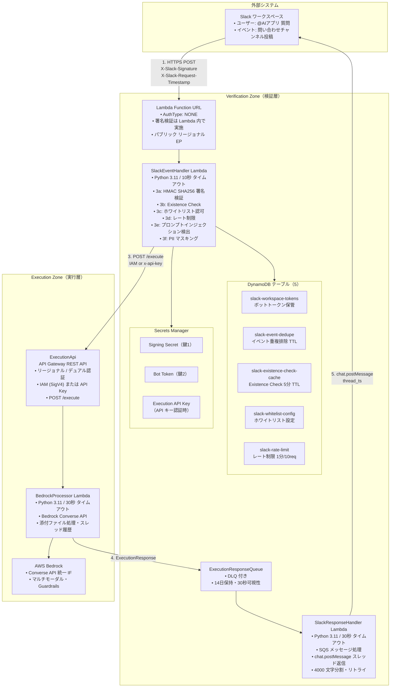

# システム構成図（AWS リソース一覧・セキュリティ詳細）

> 本ドキュメントは AWS MCP により検証した AWS サービス仕様と、プロジェクトの CDK・ドキュメントに基づき作成しています。

各コンポーネントの詳細は下表を参照。

## 1. ハイレベルシステム構成図



---

## 2. AWS リソース一覧と説明

### 2.1 Verification Stack（検証層）

| リソース種別 | 論理名 / 識別子 | 説明 |
|-------------|-----------------|------|
| **Lambda** | SlackEventHandler | 検証層の入口。署名検証(3a)、Existence Check(3b)、ホワイトリスト(3c)、レート制限(3d)、プロンプトインジェクション検出(3e)、PIIマスキング(3f)。即時 200 + リアクション返却後に ExecutionApi 呼び出し。Function URL 経由で Slack から起動。 |
| **Lambda** | SlackResponseHandler | ExecutionResponseQueue のメッセージを処理。ExecutionResponse 検証後、Slack API（chat.postMessage + thread_ts）でスレッド返信。4000 文字分割・リトライ・CloudWatch メトリクス。 |
| **Lambda Function URL** | SlackEventHandler URL | AuthType: NONE。署名検証は Lambda 内で実施。パブリック リージョナル エンドポイント。 |
| **DynamoDB** | slack-workspace-tokens | ワークスペース別 Bot Token の保管。team_id を PK に想定。 |
| **DynamoDB** | slack-event-dedupe | イベント重複排除。TTL 属性で自動削除。 |
| **DynamoDB** | slack-existence-check-cache | Existence Check の 5 分 TTL キャッシュ。キー: `{team_id}#{user_id}#{channel_id}`。 |
| **DynamoDB** | slack-whitelist-config | ホワイトリスト設定。entity_type (PK) + entity_id (SK)。DynamoDB / Secrets Manager / 環境変数から読み込み。 |
| **DynamoDB** | slack-rate-limit | レート制限用。キー: `{team_id}#{user_id}#{window_start}`。TTL でクリーンアップ。1 分あたり 10 リクエスト/ユーザー（設定可）。 |
| **Secrets Manager** | Signing Secret | Slack 署名検証用（鍵 1）。HMAC SHA256 の秘密鍵。 |
| **Secrets Manager** | Bot Token | Slack API 呼び出し・Existence Check 用（鍵 2）。xoxb- 形式。 |
| **Secrets Manager** | Execution API Key | API キー認証時の x-api-key 用。Execution Stack の API キーと対。 |
| **SQS** | ExecutionResponseQueue | 実行層からの ExecutionResponse 受信。可視性 30 秒、保持 14 日。 |
| **SQS** | ExecutionResponseDLQ | 上記キューの DLQ。失敗メッセージの退避。 |

### 2.2 Execution Stack（実行層）

| リソース種別 | 論理名 / 識別子 | 説明 |
|-------------|-----------------|------|
| **API Gateway** | ExecutionApi (REST API) | レガシー。リージョナル。POST /execute、Lambda プロキシ統合。認証: IAM (SigV4) または API キー（x-api-key）。 |
| **Lambda** | BedrockProcessor | レガシー。Bedrock Converse API 呼び出し、スレッド履歴取得、添付ファイル処理。結果を ExecutionResponseQueue に送信。 |
| **AgentCore Runtime** | Execution Agent | **新規 (Feature Flag)**。ARM64 Docker コンテナ。A2A プロトコル (JSON-RPC 2.0, port 9000)。Bedrock Converse API 呼び出し、添付ファイル処理、非同期タスク管理。SigV4 認証。 |
| **ECR** | Execution Agent Image | **新規 (Feature Flag)**。Execution Agent の Docker イメージ (Python 3.11, ARM64)。 |
| **AWS Bedrock** | Converse API | 統一 IF、マルチモーダル（テキスト+画像）。Guardrails 適用。Model Invocation Logging。 |

### 2.3 AgentCore リソース（Feature Flag: USE_AGENTCORE）

> 以下のリソースは `USE_AGENTCORE=true` 設定時にのみデプロイされます。

| リソース種別 | 論理名 / 識別子 | ゾーン | 説明 |
|-------------|-----------------|--------|------|
| **AgentCore Runtime** | Verification Agent | 検証層 | セキュリティ検証パイプライン (存在確認、認可、レート制限)。Execution Agent への A2A 委任。Slack 直接投稿。 |
| **AgentCore Runtime** | Execution Agent | 実行層 | Bedrock Converse API 呼び出し。添付ファイル処理。非同期タスク管理 (add_async_task / complete_async_task)。 |
| **AgentCore RuntimeEndpoint** | DEFAULT (各 Agent) | 両方 | 各 Runtime のデフォルトエンドポイント。 |
| **ECR** | Verification Agent Image | 検証層 | Python 3.11, ARM64 コンテナイメージ。 |
| **ECR** | Execution Agent Image | 実行層 | Python 3.11, ARM64 コンテナイメージ。 |
| **IAM Role** | *-ExecutionRole | 両方 | AgentCore Runtime 実行ロール。ECR, CloudWatch, X-Ray, DynamoDB, Secrets Manager, bedrock-agentcore:InvokeAgentRuntime 権限。 |
| **リソースベースポリシー** | RuntimeResourcePolicy | 実行層 | クロスアカウント時、Verification Account に InvokeAgentRuntime を許可。 |

### 2.3 監視・監査

| リソース種別 | 用途 | 説明 |
|-------------|------|------|
| **CloudWatch Logs** | 各 Lambda | 構造化 JSON ログ、相関 ID、PII マスキング済み。 |
| **CloudWatch Metrics** | SlackEventHandler | ExistenceCheckFailed/CacheHit/CacheMiss、WhitelistAuthorizationSuccess/Failed、RateLimitExceeded、PromptInjectionDetected 等。 |
| **CloudWatch Metrics** | BedrockProcessor | BedrockApiError、Lambda エラー等。 |
| **CloudWatch Alarms** | セキュリティ・運用 | ExistenceCheck 失敗、ホワイトリスト認可失敗、レート制限超過、Bedrock API エラー、Lambda エラー。 |
| **CloudTrail** | 監査 | 全 Bedrock 呼び出し、API Gateway、Lambda、DynamoDB、Secrets Manager、SQS 等の API イベント。 |

---

## 3. セキュリティ詳細（多層防御）

### 3.1 認証・認可の多層構造

```
[1] Slack レイヤー        : SSO + MFA（Slack 側）
[2] Function URL          : 認証なし（署名検証は Lambda 内）
[3] SlackEventHandler     : 3a〜3f（下記）
[4] ExecutionApi          : IAM 認証 または API キー認証
[5] BedrockProcessor      : 最小権限 IAM、Bedrock Guardrails
[6] Bedrock               : Automated Reasoning、Guardrails コンテンツフィルタ
```

### 3.2 レイヤー 3a: 署名検証（鍵 1）

| 項目 | 内容 |
|------|------|
| **方式** | HMAC SHA256。`v0:{timestamp}:{body}` を Signing Secret で署名し、`X-Slack-Signature` と定数時間比較。 |
| **リプレイ対策** | `X-Slack-Request-Timestamp` を検証。±5 分を超える場合は拒否。 |
| **秘密情報** | Secrets Manager: Signing Secret。 |
| **防ぐ脅威** | T-01（署名シークレット漏洩時は 3b と 2 鍵で軽減）、T-03（リプレイ）、T-04（Function URL 漏洩）。 |

### 3.3 レイヤー 3b: Slack API Existence Check（鍵 2）

| 項目 | 内容 |
|------|------|
| **方式** | Bot Token で Slack API を呼び出し、team_id / user_id / channel_id の実在を確認。`team.info`、`users.info`、`conversations.info`。 |
| **キャッシュ** | DynamoDB `slack-existence-check-cache`。キー: `{team_id}#{user_id}#{channel_id}`。TTL 5 分。 |
| **失敗時** | Slack API ダウン・タイムアウト（>2 秒）は **fail-closed**（拒否）。 |
| **秘密情報** | Secrets Manager: Bot Token。DynamoDB: ワークスペース別トークン。 |
| **防ぐ脅威** | T-01（Signing Secret のみ漏洩時）、偽造リクエスト、削除済みエンティティの悪用。 |

### 3.4 レイヤー 3c: ホワイトリスト認可

| 項目 | 内容 |
|------|------|
| **条件** | 条件付き AND。設定されている entity のみチェック。team_id / user_id / channel_id。 |
| **空のとき** | いずれも未設定なら**全許可**。 |
| **設定ソース** | 1) DynamoDB `slack-whitelist-config`、2) Secrets Manager `{stack}/slack/whitelist-config`、3) 環境変数。メモリ 5 分 TTL キャッシュ。 |
| **失敗時** | 設定読み込み失敗は **fail-closed**。未認可 entity は 403 + セキュリティログ。 |
| **防ぐ脅威** | T-08（権限昇格）、未許可 WS/ユーザー/チャンネルからの利用。 |

### 3.5 レイヤー 3d: レート制限

| 項目 | 内容 |
|------|------|
| **方式** | DynamoDB `slack-rate-limit`。キー: `{team_id}#{user_id}#{window_start}`。トークンバケット（1 分窓、デフォルト 10  req/分/ユーザー）。 |
| **超過時** | 429 Too Many Requests。DynamoDB エラー時は **fail-open**（レート制限のみ）。 |
| **防ぐ脅威** | T-07（DDoS / レート乱用）、T-11（モデル乱用・コスト）。 |

### 3.6 レイヤー 3e: プロンプトインジェクション検出

| 項目 | 内容 |
|------|------|
| **方式** | メッセージ長上限 4000 文字。既知パターン（"ignore previous instructions", "system prompt", "jailbreak" 等）のマッチ。大文字小文字無視。 |
| **検出時** | 400 Bad Request。具体的なパターンは返さず、ログに記録（PII マスキング適用）。 |
| **防ぐ脅威** | T-06（コマンド／プロンプトインジェクション）、T-13（プロンプトインジェクション）。 |

### 3.7 レイヤー 3f: PII マスキング

| 項目 | 内容 |
|------|------|
| **対象** | team_id, user_id, channel_id, bot_token, signing_secret。 |
| **ルール** | DEBUG: そのまま。INFO: 部分マスキング（例 `T123***`）。WARN/ERROR/CRITICAL: SHA-256 ハッシュ先頭 8 文字。再帰的サニタイズ。 |
| **ソルト** | 環境変数 `PII_HASH_SALT`（本番で変更推奨）。 |

### 3.8 レイヤー 4: ExecutionApi の認証

| 方式 | 説明 | リソース |
|------|------|----------|
| **IAM** | SlackEventHandler が SigV4 で Invoke。API Gateway のリソースポリシーで当該ロール／アカウントを Allow。 | IAM ロール、API Gateway リソースポリシー |
| **API キー** | `x-api-key` に Secrets Manager の Execution API Key を設定。API Gateway の API キー＋リソースポリシーで許可。 | Secrets Manager、API Gateway 使用量プラン・API キー |

### 3.9 レイヤー 5–6: Bedrock 周辺

| 項目 | 内容 |
|------|------|
| **Guardrails** | コンテンツフィルタ（Hate, Insults, Sexual, Violence, Misconduct, Prompt Attack）、Denied Topics、Word フィルタ、PII 検出・マスク、Contextual grounding、Automated Reasoning（AWS ドキュメント準拠）。 |
| **トークン制限** | モデル別最大（Claude 4.5 / Nova Pro: 8192、Nova Lite: 4096 等）。`BEDROCK_MAX_TOKENS` で上書き可。 |
| **CloudTrail** | 全 `bedrock:InvokeModel` / `InvokeModelWithResponseStream` を記録。 |
| **最小権限** | BedrockProcessor の IAM は Bedrock 呼び出しと、必要に応じた DynamoDB/Logs 等に限定。 |

### 3.10 データストアの暗号化

| リソース | 暗号化 | 備考 |
|----------|--------|------|
| **DynamoDB** | 保存時暗号化（SSE）有効。AWS 所有キーまたは KMS。 | 全 5 テーブル。 |
| **Secrets Manager** | デフォルト KMS 暗号化。 | Signing Secret、Bot Token、Execution API Key。 |
| **SQS** | オプションで KMS によるサーバーサイド暗号化。 | 本番で検討推奨。 |

### 3.11 失敗時ポリシー（Fail-Closed / Fail-Open）

| 処理 | 失敗時 | 理由 |
|------|--------|------|
| 署名検証 | Fail-closed | 真正性が担保できない。 |
| Existence Check | Fail-closed | 実在性が担保できない。 |
| ホワイトリスト読み込み | Fail-closed | 認可判断ができない。 |
| レート制限（DynamoDB 等） | Fail-open | 可用性優先（レート制限のみ）。 |

---

## 4. データフローとスタック構成

### 4.1 リクエストフロー（番号は概要図と対応）

1. **Slack → Function URL**  
   HTTPS POST。`X-Slack-Signature`、`X-Slack-Request-Timestamp`、`response_url`、本文。

2. **SlackEventHandler**  
   署名検証 → Existence Check → ホワイトリスト → レート制限 → プロンプトインジェクション検出。通過後、即 200 とリアクション（👀）返却。

3. **SlackEventHandler → ExecutionApi**  
   POST /execute。Body: channel, text, bot_token, thread_ts, attachments。IAM または x-api-key で認証。

4. **BedrockProcessor**  
   Bedrock Converse 呼び出し、添付・履歴処理。ExecutionResponse を SQS に送信。

5. **SlackResponseHandler**  
   SQS 受信 → 検証 → `chat.postMessage`（thread_ts）で Slack に返信。

### 4.2 スタック分離（単一 / クロスアカウント）

- **VerificationStack**  
  SlackEventHandler、Function URL、5 DynamoDB、Secrets Manager、ExecutionResponseQueue＋DLQ、SlackResponseHandler、CloudWatch アラーム。

- **ExecutionStack**  
  ExecutionApi、BedrockProcessor、Bedrock 利用、CloudWatch アラーム。  
  必要に応じ `executionResponseQueueUrl` を渡し、BedrockProcessor に SQS 送信権限を付与。

- **クロスアカウント**  
  Verification を Account A、Execution を Account B に配置可能。API Gateway のリソースポリシーで Account A の SlackEventHandler ロールを Allow。API キー認証の場合は、Principal `*` と API キーによる制御。

---

## 5. 参照

- [アーキテクチャ概要](./overview.md)
- [ゾーン間通信](./zone-communication.md) - Slack・検証ゾーン・実行ゾーン間の通信方式
- [セキュリティ要件](../security/requirements.md)
- [セキュリティ実装](../security/implementation.md)
- [脅威モデル](../security/threat-model.md)
- [クロスアカウントアーキテクチャ](./cross-account.md)
- [AWS Lambda Function URL - 認証](https://docs.aws.amazon.com/lambda/latest/dg/urls-auth.html)
- [API Gateway リソースポリシー](https://docs.aws.amazon.com/apigateway/latest/developerguide/apigateway-resource-policies.html)
- [DynamoDB 保存時暗号化](https://docs.aws.amazon.com/amazondynamodb/latest/developerguide/EncryptionAtRest.html)
- [Amazon Bedrock Guardrails](https://docs.aws.amazon.com/bedrock/latest/userguide/guardrails.html)
