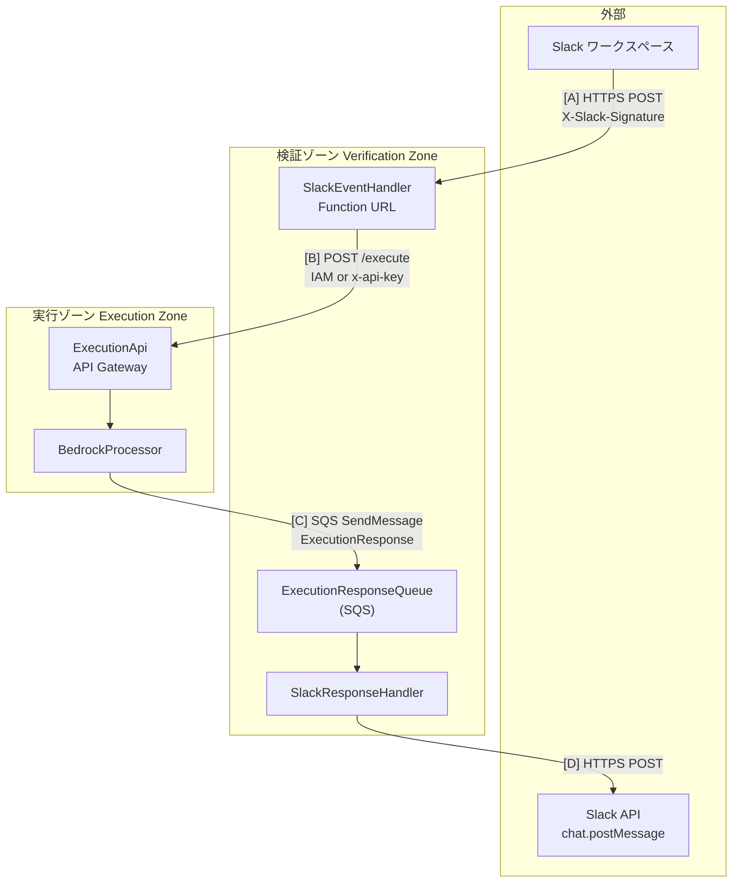
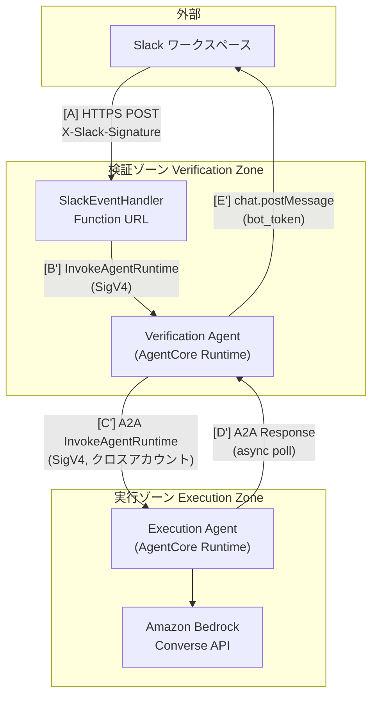
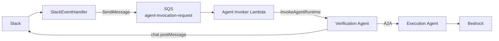

# ゾーン間通信の整理

> 本ドキュメントは **Slack ワークスペース → 検証ゾーン**、**検証ゾーン → 実行ゾーン**、**実行ゾーン → 検証ゾーン** の通信方法を整理したものです。

---

## 1. 概要図



| 経路 | 起点 | 終点 | 方式 | 同期/非同期 |
|------|------|------|------|-------------|
| **[A]** | Slack ワークスペース | 検証ゾーン | HTTPS POST（Function URL） | 同期（3秒制約） |
| **[B]** | 検証ゾーン | 実行ゾーン | HTTPS POST（API Gateway） | 非同期（即座に 200 返却後） |
| **[C]** | 実行ゾーン | 検証ゾーン | SQS `SendMessage` | 非同期 |
| **[D]** | 検証ゾーン | Slack ワークスペース | HTTPS POST（Slack API） | 非同期（SQS トリガー後） |

---

## 2. Slack ワークスペース → 検証ゾーン [A]

### 2.1 通信方式

| 項目 | 内容 |
|------|------|
| **プロトコル** | HTTPS |
| **エンドポイント** | Lambda Function URL（SlackEventHandler） |
| **HTTP メソッド** | POST |
| **認証** | Function URL は `AuthType: NONE`。**署名検証は Lambda 内で実施**。 |

### 2.2 リクエスト形式

- **Content-Type**: `application/x-www-form-urlencoded`（Slack の slash コマンド／イベント形式）
- **必須ヘッダー**:
  - `X-Slack-Signature`: HMAC SHA256 署名（`v0={hex}` 形式）
  - `X-Slack-Request-Timestamp`: リクエスト発行時刻（Unix 秒、リプレイ防止用）

### 2.3 ボディ（主要フィールド）

| フィールド | 説明 |
|------------|------|
| `team_id` | Slack ワークスペース ID |
| `user_id` | ユーザー ID |
| `channel_id` | チャンネル ID |
| `text` | ユーザー入力テキスト |
| `thread_ts` | スレッドタイムスタンプ（スレッド返信用、任意） |
| `response_url` | レスポンス用 Webhook URL（任意） |
| `trigger_id` | トリガー ID（任意） |

※ イベント subscription の場合は JSON ボディ（`event` 等）となる。

### 2.4 検証ゾーン側の受け口と検証

| コンポーネント | 役割 |
|----------------|------|
| **Lambda Function URL** | パブリック・リージョナルエンドポイント。受信後 SlackEventHandler に渡す。 |
| **SlackEventHandler** | 署名検証（HMAC SHA256、Signing Secret）、Existence Check（Bot Token）、ホワイトリスト、レート制限、重複排除など。 |

### 2.5 レスポンス

- **成功時**: HTTP 200 + 即座の応答（例: リアクション 👀 など）。Slack の 3 秒タイムアウトを満たすため、ここでは **AI 結果は返さない**。
- **失敗時**: 401（署名不正）、403（認可・Existence Check 失敗）、429（レート制限）など。

### 2.6 関連ドキュメント

- [アーキテクチャ概要](./overview.md)
- [認証・認可](../security/authentication-authorization.md)

---

## 3. 検証ゾーン → 実行ゾーン [B]

### 3.1 通信方式

| 項目 | 内容 |
|------|------|
| **プロトコル** | HTTPS |
| **エンドポイント** | Execution API（API Gateway REST API） `POST /execute` |
| **呼び出し元** | SlackEventHandler（検証完了後） |

### 3.2 認証（デュアル認証）

| 方式 | 説明 | デフォルト |
|------|------|------------|
| **API キー認証** | ヘッダー `x-api-key` に Secrets Manager の API キーを設定 | ✅ デフォルト |
| **IAM 認証** | AWS SigV4 署名。SlackEventHandler の IAM ロールで `execute-api:Invoke`。 | オプション |

- 認証方法: 環境変数 `EXECUTION_API_AUTH_METHOD`（`api_key` | `iam`）
- API キー: `EXECUTION_API_KEY_SECRET_NAME` で Secrets Manager のシークレット名を指定（デフォルト: `execution-api-key`）

### 3.3 リクエスト（POST /execute）

**Content-Type**: `application/json`

**Body 例**:

```json
{
  "channel": "C01234567",
  "text": "ユーザーの質問テキスト",
  "bot_token": "xoxb-...",
  "thread_ts": "1234567890.123456",
  "attachments": [
    {
      "id": "F01234567",
      "name": "image.png",
      "mimetype": "image/png",
      "size": 1024,
      "url_private_download": "https://..."
    }
  ]
}
```

| フィールド | 必須 | 説明 |
|------------|------|------|
| `channel` | ✅ | チャンネル ID |
| `text` | ✅ | ユーザーメッセージ |
| `bot_token` | ✅ | Slack Bot Token（実行ゾーンでスレッド履歴取得・添付ダウンロードに使用。Slack 投稿は行わず、ExecutionResponse に含めて SQS で検証ゾーンへ渡す。検証ゾーンが `bot_token` で `chat.postMessage` を実行） |
| `thread_ts` | - | スレッド返信用タイムスタンプ |
| `attachments` | - | 添付ファイルメタデータの配列 |

### 3.4 実行ゾーン側の受け口

| コンポーネント | 役割 |
|----------------|------|
| **API Gateway** | リソースポリシーで SlackEventHandler ロール（IAM 時）または API キーを許可。Lambda Proxy 統合。 |
| **BedrockProcessor** | リクエスト受信、Bedrock 呼び出し、添付・履歴処理。**レスポンスは Slack に直接返さず、SQS に送信**。 |

### 3.5 クロスアカウント

- 検証ゾーン（Account A）と実行ゾーン（Account B）を分離可能。
- IAM 認証: API Gateway のリソースポリシーで Account A の `SlackEventHandlerRole` を `Allow`。
- API キー認証: `Principal: "*"` とし、API キー＋使用量プランで制御。

### 3.6 関連ドキュメント

- [クロスアカウントアーキテクチャ](./cross-account.md)
- [認証・認可](../security/authentication-authorization.md)

---

## 4. 実行ゾーン → 検証ゾーン [C]

### 4.1 通信方式

| 項目 | 内容 |
|------|------|
| **プロトコル** | AWS SQS（`SendMessage`） |
| **キュー** | **ExecutionResponseQueue**（検証ゾーン側で作成・所有） |
| **送信元** | BedrockProcessor（実行ゾーン） |
| **受信・消費** | SlackResponseHandler（検証ゾーン、SQS が Lambda をトリガー） |

### 4.2 なぜ HTTP ではなく SQS か

- 実行ゾーンと検証ゾーンを**疎結合**にし、Bedrock の処理時間（数秒～数十秒）に左右されない。
- 検証ゾーンは「Slack に投稿する」責務に集中。実行ゾーンは「Bedrock 実行とレスポンス整形」に集中。
- **現在の構成**: ゾーン間通信は AgentCore A2A のみ。SQS は使用しません（レガシー経路は削除済み）。

### 4.3 メッセージ形式（ExecutionResponse）

**SQS の `MessageBody`**: JSON 文字列（ExecutionResponse オブジェクトの文字列化）

| フィールド | 必須 | 説明 |
|------------|------|------|
| `status` | ✅ | `"success"` または `"error"` |
| `channel` | ✅ | 投稿先チャンネル ID |
| `thread_ts` | - | スレッド返信用 |
| `correlation_id` | - | 相関 ID（トレース用） |
| `bot_token` | ✅ | 検証ゾーンが `chat.postMessage` で使用する Bot Token |
| `response_text` | status=success 時 | AI 生成テキスト |
| `error_code` | status=error 時 | 例: `bedrock_timeout` |
| `error_message` | status=error 時 | ユーザー向けエラーメッセージ |

**成功例**:

```json
{
  "status": "success",
  "channel": "C01234567",
  "thread_ts": "1234567890.123456",
  "correlation_id": "550e8400-e29b-41d4-a716-446655440000",
  "bot_token": "xoxb-...",
  "response_text": "AI が生成した回答テキスト"
}
```

**エラー例**:

```json
{
  "status": "error",
  "channel": "C01234567",
  "thread_ts": "1234567890.123456",
  "correlation_id": "550e8400-e29b-41d4-a716-446655440000",
  "bot_token": "xoxb-...",
  "error_code": "bedrock_timeout",
  "error_message": "AI の応答が遅れています。しばらくして再度お試しください。"
}
```

### 4.4 検証ゾーン側の処理（SlackResponseHandler）

1. SQS からメッセージ受信（ExecutionResponse をパース）
2. ExecutionResponse の検証（必須フィールド、`status` に応じた `response_text` / `error_*` の有無）
3. Slack API `chat.postMessage`（`thread_ts`、`bot_token` 使用）でスレッドに投稿
4. 4000 文字超の場合は分割投稿、リトライ、CloudWatch メトリクス

### 4.5 キュー・デプロイ設定

| 項目 | 内容 |
|------|------|
| **ExecutionResponseQueue** | Verification Stack で作成。可視性 30 秒、保持 14 日。DLQ あり。 |
| **現在** | ゾーン間は AgentCore A2A のみ。Verification Stack は `executionAgentArn` で Execution Agent を呼び出し。 |

### 4.6 関連ドキュメント

- [011-verification-slack-response data-model](../../../specs/011-verification-slack-response/data-model.md)
- [アーキテクチャ概要](./overview.md)

---

## 5. 検証ゾーン → Slack ワークスペース [D]（補足）

SQS で受け取った結果を Slack に反映する経路。

| 項目 | 内容 |
|------|------|
| **プロトコル** | HTTPS |
| **API** | Slack API `chat.postMessage` |
| **呼び出し元** | SlackResponseHandler |
| **認証** | `bot_token`（ExecutionResponse に含まれる） |
| **投稿先** | `channel` + `thread_ts` でスレッド内に投稿。4000 文字制限のため分割あり。 |

---

## 6. AgentCore A2A 通信パス（唯一のゾーン間経路）

> ゾーン間通信は AgentCore A2A のみです。API Gateway および SQS のレガシー経路は削除済みです。

### 6.1 通信フロー概要



| 経路 | 起点 | 終点 | 方式 | 同期/非同期 |
|------|------|------|------|-------------|
| **[A]** | Slack | 検証ゾーン Lambda | HTTPS POST (Function URL) | 同期 (3秒制約) |
| **[B']** | SlackEventHandler | Verification Agent | InvokeAgentRuntime (SigV4) | 非同期 (即座に 200) |
| **[C']** | Verification Agent | Execution Agent | A2A InvokeAgentRuntime (SigV4) | 非同期 (accepted → poll) |
| **[D']** | Execution Agent | Verification Agent | A2A Response (GetAsyncTaskResult) | 非同期ポーリング |
| **[E']** | Verification Agent | Slack API | chat.postMessage | 非同期 |

### 6.2 検証ゾーン → 実行ゾーン [C'] (A2A)

| 項目 | 内容 |
|------|------|
| **プロトコル** | A2A (JSON-RPC 2.0 over HTTP, port 9000) |
| **エンドポイント** | Execution Agent AgentCore Runtime |
| **呼び出し元** | Verification Agent (`a2a_client.py`) |
| **認証** | SigV4 (boto3 自動署名) |
| **クロスアカウント** | リソースベースポリシーで許可 |

**ペイロード例**:

```json
{
  "channel": "C01234567",
  "text": "ユーザーの質問テキスト",
  "bot_token": "xoxb-...",
  "thread_ts": "1234567890.123456",
  "attachments": [],
  "correlation_id": "550e8400-e29b-41d4-a716-446655440000",
  "team_id": "T01234567",
  "user_id": "U01234567"
}
```

### 6.3 非同期レスポンスパターン

1. Execution Agent は即座に `{"status": "accepted", "task_id": "..."}` を返却
2. バックグラウンドスレッドで Bedrock 処理を実行
3. 完了後 `complete_async_task(task_id, result)` を呼び出し
4. Verification Agent は `GetAsyncTaskResult` でポーリング (指数バックオフ)
5. 結果取得後、Slack API に直接投稿

### 6.4 Agent Discovery

各エージェントは以下のエンドポイントを公開:

| エンドポイント | 内容 |
|----------------|------|
| `/.well-known/agent-card.json` | Agent Card (A2A 仕様準拠) |
| `/ping` | ヘルスチェック (`Healthy` / `HealthyBusy`) |

### 6.5 014: ファイル artifact フロー（Execution → Verification → Slack）

Execution Agent が AI 生成ファイル（CSV/JSON/テキスト等）を返す場合:

1. **Execution Agent**: 成功レスポンスの `result` に `file_artifact` を付与。形式は `specs/014-a2a-file-to-slack/contracts/a2a-file-artifact.yaml` に準拠（`name: "generated_file"`、`parts` に Base64 エンコード内容・fileName・mimeType）。
2. **制限**: 最大ファイルサイズ 5 MB（環境変数で変更可）、許可 MIME は `text/csv`, `application/json`, `text/plain`。超過・許可外の場合はファイルを付けず、テキストで理由を返す（FR-005, FR-006）。
3. **Verification Agent**: `parse_file_artifact(result_data)` で `file_artifact` を取得し、Base64 デコード後に `post_file_to_slack` を呼び出し。Slack API は `files.getUploadURLExternal` → POST → `files.completeUploadExternal`（または SDK `files_upload_v2`）を使用。投稿順序はテキスト → ファイル（FR-004）。失敗時は同一スレッドにエラーメッセージを投稿（FR-007）。
4. **Slack Bot スコープ**: Verification 用 Bot に `files:write` が必要。詳細は `specs/014-a2a-file-to-slack/quickstart.md` および契約 `contracts/slack-file-poster.yaml` を参照。

### 6.6 016: 非同期起動フロー（SlackEventHandler → SQS → Agent Invoker）

016 では、Slack の 3 秒制約と Lambda タイムアウトを避けるため、メンション受信後に **InvokeAgentRuntime を同期的に呼ばず**、実行リクエストを SQS に送って即 200 を返す。

**016 のデータフロー**:

1. **Slack** → メンションイベントを **SlackEventHandler**（Function URL）に POST
2. **SlackEventHandler** 内で署名検証・Existence Check・Whitelist・レート制限・重複排除・👀 リアクション付与
3. **SlackEventHandler** は InvokeAgentRuntime を呼ばず、**AgentInvocationRequest** を **SQS（agent-invocation-request）** に送信して即 200 を返す
4. **SQS** が **Agent Invoker Lambda** を起動
5. **Agent Invoker Lambda** がメッセージから task_data を復元し、**InvokeAgentRuntime(Verification Agent)** を呼ぶ
6. 以降は 6.1 と同様: **Verification Agent** → A2A → **Execution Agent** → Bedrock → 結果を **Verification Agent** が Slack API で投稿



**責務の整理（016 でも変更なし）**:

- **Slack への投稿は検証ゾーンのみ**: Verification Agent が `post_to_slack` / `post_file_to_slack` を実行する。Agent Invoker Lambda は Verification Agent を起動するだけで、Slack には直接投稿しない。
- **アカウント間通信は A2A のみ**: 検証アカウントと実行アカウントの間は、従来どおり AgentCore A2A（InvokeAgentRuntime + SigV4）のみ。SQS は検証アカウント内（SlackEventHandler → Agent Invoker）の非同期化用であり、ゾーン間には使わない。

---

## 7. 一覧まとめ

### レガシーパス (API Gateway + SQS)

| 経路 | 方式 | 認証 | データ形式 | 備考 |
|------|------|------|------------|------|
| **Slack → 検証** | HTTPS POST（Function URL） | 署名検証（Lambda 内） | `application/x-www-form-urlencoded` または JSON | 3 秒以内に 200 返却 |
| **検証 → 実行** | HTTPS POST（API Gateway） | IAM または `x-api-key` | `application/json`（channel, text, bot_token, thread_ts, attachments） | 非同期、即 200 後 Invoke |
| **実行 → 検証** | SQS `SendMessage` | 検証ゾーン所有キューへ、Execution に `sqs:SendMessage` 権限 | JSON（ExecutionResponse） | 疎結合・クロスアカウント対応 |
| **検証 → Slack** | HTTPS POST（Slack API） | `bot_token` | `chat.postMessage`（channel, text, thread_ts） | SQS トリガー後の非同期 |

### AgentCore A2A パス（現行）

| 経路 | 方式 | 認証 | データ形式 | 備考 |
|------|------|------|------------|------|
| **Slack → 検証** | HTTPS POST（Function URL） | 署名検証（Lambda 内） | JSON | 3 秒以内に 200 返却 |
| **Lambda → Verification Agent** | InvokeAgentRuntime | SigV4 | JSON (A2A payload) | Lambda から AgentCore Runtime を呼び出し |
| **Verification → Execution Agent** | A2A InvokeAgentRuntime | SigV4 (クロスアカウント対応) | JSON-RPC 2.0 | 非同期 (accepted → poll) |
| **Execution → Verification Agent** | GetAsyncTaskResult | SigV4 | JSON (ExecutionResponse) | ポーリング (指数バックオフ) |
| **Verification Agent → Slack** | HTTPS POST（Slack API） | `bot_token` | `chat.postMessage` | 直接投稿 (SQS 不要) |

---

## 7. 関連ドキュメント

- [アーキテクチャ概要](./overview.md)
- [システム構成図](./system-architecture-diagram.md)
- [クロスアカウントアーキテクチャ](./cross-account.md)
- [認証・認可](../security/authentication-authorization.md)
- [実装詳細](./implementation-details.md)
